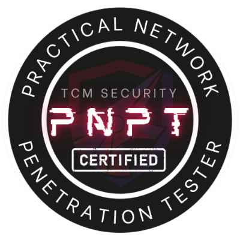

<div align="center">

# Adithya Karthik M

### Security Researcher · Reverse Engineer · Builder

*Breaking things to understand how they're built. Building things to understand how they break.*


</div>

---

## `whoami`

```text
                _     _ _            _   
  __ _ _ __ ___| |__ (_) |_ ___  ___| |_ 
 / _` | '__/ __| '_ \| | __/ _ \/ __| __|
| (_| | | | (__| | | | | ||  __/ (__| |_ 
 \__,_|_|  \___|_| |_|_|\__\___|\___|\__|

           [ 0xARCHITECT ]
           
    build. break. understand. repeat.
```

```text
$ whoami
> Adithya Karthik M

$ cat interests.txt
> security
> reverse engineering
> breaking things that probably worked fine before I touched them

$ status
> still learning...
> still building...
> probably debugging something at 2 AM.
```

I'm a cybersecurity professional and developer from Bangalore, India, interested in understanding systems from the inside out.

My work sits at the intersection of **offensive security, reverse engineering, software engineering, and security automation**.

I enjoy taking complicated systems apart, understanding why they behave the way they do, and occasionally building something new from what I learn.

Currently exploring deeper into **reverse engineering, vulnerability research, agentic security tooling, and low-level systems**.

---

## `~/current`

```yaml
focus:
  - Reverse Engineering
  - Vulnerability Research
  - Offensive Security
  - Agentic Pentesting
  - Security Tooling

building:
  - Security automation
  - Offensive security infrastructure
  - Experimental developer tools

learning:
  - x86 / x86-64
  - Windows Internals
  - Malware Analysis
  - Binary Exploitation
  - Advanced Red Team Operations
```

---

## `~/security`

**Offensive Security**


**Languages**


**Engineering**


---

## `~/certifications`

<table>
<tr>
<td width="180" align="center">



</td>
<td>

### PNPT

**Practical Network Penetration Tester**

Hands-on penetration testing covering:

`Active Directory` · `OSINT` · `Linux PrivEsc` · `Windows PrivEsc` · `Network Pentesting` · `Reporting`

**TCM Security**

</td>
</tr>
</table>

> `Achievement unlocked: professional permission to break things.` 🔓

---

## `~/research`

Things I'm particularly interested in:

```text
[0x01] Reverse Engineering
[0x02] Windows Internals
[0x03] Binary Analysis
[0x04] Vulnerability Research
[0x05] Malware Analysis
[0x06] Active Directory Security
[0x07] Red Team Infrastructure
[0x08] Security Automation
[0x09] Agentic Offensive Security
[0x0A] AI × Cybersecurity
```

Expect repositories here to increasingly contain **research notes, experiments, tooling, labs, writeups, and things I probably broke while trying to understand them.**

---

## `~/philosophy`

```text
             ┌───────────────────────────────┐
             │                               │
             │     BUILD → BREAK → LEARN     │
             │        ↑              │       │
             │        └──────────────┘       │
             │                               │
             └───────────────────────────────┘
```

> **Understand the system before trying to defeat it.**

I don't particularly care about collecting tools.

I'm more interested in understanding **why they work**.

That curiosity is what pulled me from programming → cybersecurity → offensive security → and eventually deeper into reverse engineering.

There is always another abstraction layer to peel away.

---

## `~/stats`

<div align="center">
  
[](https://github-stats-extended.vercel.app/api?username=captainion2119&rank_icon=github&show_icons=true&include_all_commits=true&theme=monokai)

</div>

---

## `~/labs`

<div align="center">


</div>

---

## `~/connect`

[](https://www.linkedin.com/in/adithya-karthik-m/)
[](https://instagram.com/0xarch1t3ct)

---

```text
┌─[0xarchitect@github]─[~]
└──╼ $ ./keep_building.sh

[*] curiosity ............ enabled
[*] caffeine ............. probably
[*] bugs .................. definitely
[*] understanding ........ in progress

[+] See you somewhere below the abstraction layer.
```

<div align="center">

**`0xARCHITECT // BUILD · BREAK · UNDERSTAND · REPEAT`**

</div>
